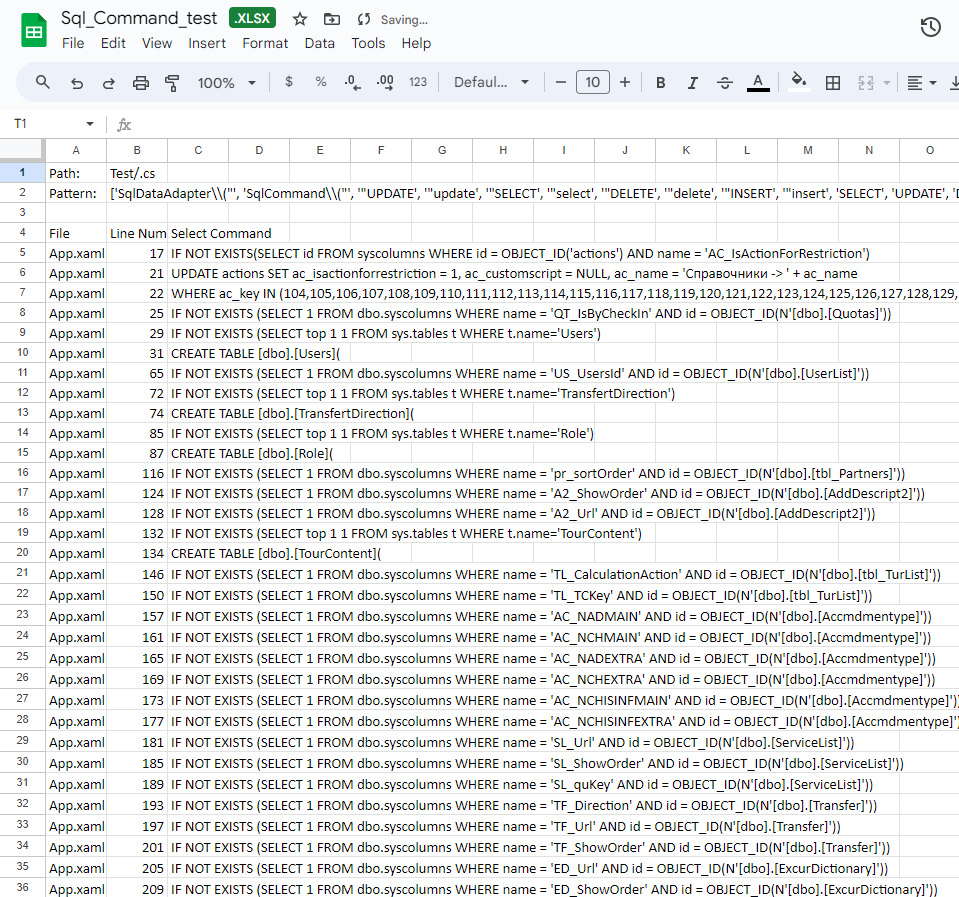

# SQL-injection-finder

This program will take any C# or ASP.NET files and record all instances of an SQL injection or use of an SQL controller in .NET. It will then export the results to an excel 
sheet with three columns that contain the file name, the line number, and the SQL injection.

# Regex Pattern Matching

The entries array contains an absolute path to the folder you want to search,
a tuple containing a string (appears in excel sheet), an array of the patterns you
want to search for, and the name of the excel sheet you want to create. The last
element is a value specifying whether you want to search through a C# file or
.ascx file. Edit the array of patterns to narrow or widen your search.

Using the test file App.xaml.cs with these values:

```python
entries = [
    (
        os.path.abspath("../String-Finder-1.0.0/Parts-Test"), #This contains App.xaml.cs
        ["Test/.cs", 
        [r'SqlDataAdapter\("', r'SqlCommand\("', r'"UPDATE', r'"update', r'"SELECT', r'"select', r'"DELETE',
r'"delete', r'"INSERT', r'"insert', r'SELECT', r'UPDATE', r'DELETE', r'CREATE', r'WHERE', r'SqlCommand\('],
        "Sql_Command_Test.xlsx"],
        "csharp"
    ),

#Later in the script, we also filter out commented lines with
match = re.match(r'^/', line.strip())
```

We will create the following excel sheet:


